About Noggin
============
**Noggin** is a self-service portal for creating and managing user accounts and groups.

User accounts
=============

How do I create a new account?
******************************

To create a new account, go to the Noggin home page, choose the register tab, and fill out your basic details:

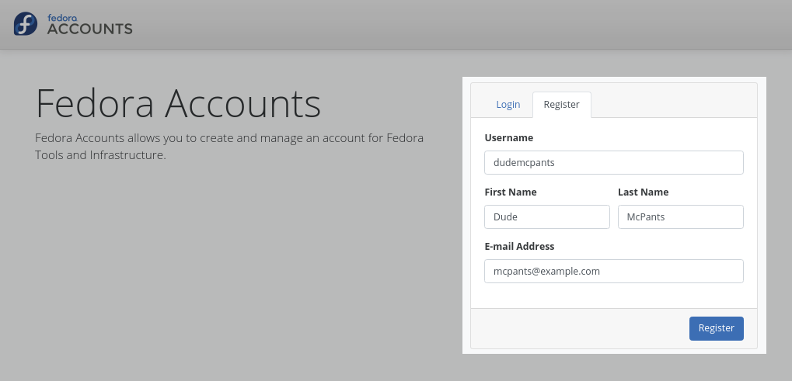

An email will be sent to your provided email address that includes a validation link, follow this link back to
Noggin to validate your email, then set your password:

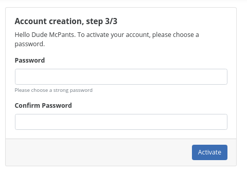

After setting your password you will be logged into your new account automatically:

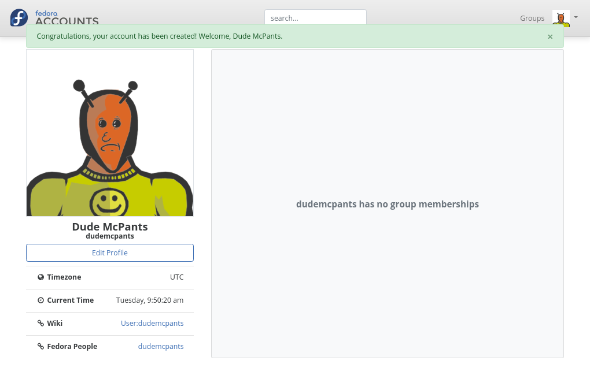

Group Members
=============

How do I become a member of a group?
************************************

Group Sponsors have the ability to add new members to the group. A group should provide the information required to request
access to the group, otherwise contact a group sponsor directly.

Previously, In FAS2, a user could request access to a group, which a group admininstrator could either approve or deny.
In Noggin, users are simply just added to the group by a sponsor after requesting access through other channels for that
group, such as email or IRC.

How do I stop being a member of a group?
****************************************

As a group member, you can choose to leave a group at anytime. Press the leave group button on the group detail page:

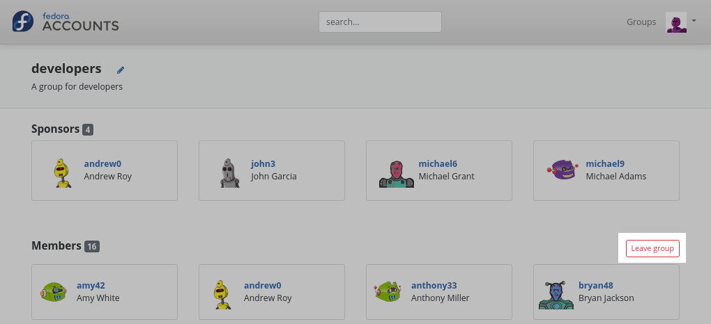

If you are the sponsor of a group, you can simply remove yourself from the group, as you would remove any other user.

Group Sponsors
==============

What is a group sponsor?
************************
Groups in Noggin have users with a special *sponsor* privilege. If a user is a sponsor of a group,
they are able to add and remove group members. The sponsors of a group are listed above the group members.

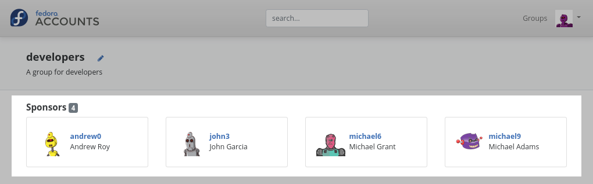

Previously in  FAS2, groups had special *admininstrator* users that had the ability to add both new members and new admininstrators to a group.
In Noggin, groups have *Sponsors* which have the ability to add new members to a group.

How do I become a sponsor of a group?
*************************************
To become a sponsor of a group, you will need to talk to whomever administrates your Noggin system.

.. note::
    In the Fedora Noggin deployment, this is achieved by filing a ticket at https://pagure.io/fedora-infrastructure/new_issue

How do I stop being a sponsor of a group?
*****************************************
To stop being a sponsor of a group, you will need to talk to whomever administrates your Noggin system

.. note::
    In the Fedora Noggin deployment, this is achieved by filing a ticket at https://pagure.io/fedora-infrastructure/new_issue

As a group sponsor, how do I add members to the group?
******************************************************
Add new members to a group in the group detail page. If you are the sponsor of a group, a search bar is
visible at the top of the user listing on the group detail page:

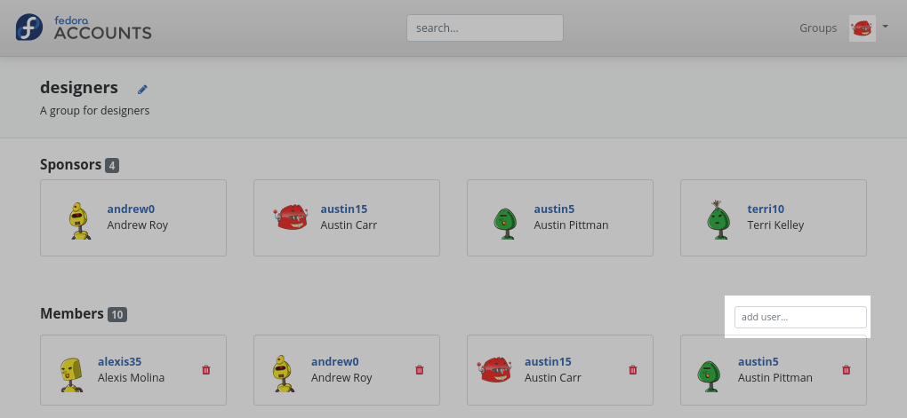

Simply search for the user that you want to add, and press enter to add them to the group:

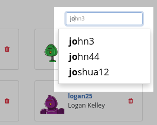

As a group sponsor, how do I remove members from a group?
*********************************************************
Remove members from a group in the group detail page. If you are the sponsor of a group, each of the users
in the user listing have a trash icon button. Simply click this to remove this user from the group.

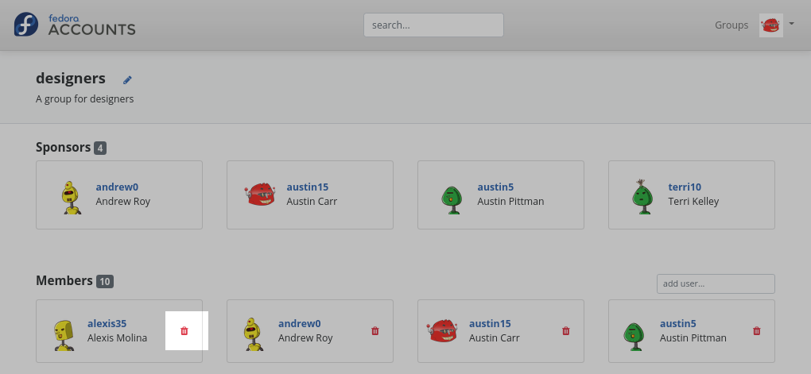

Two Factor authentication
=========================

How do I add and use two-factor authentication?
***********************************************
Noggin features the ability to configure and user two-factor authentication through the user of OTP tokens.
by default, Noggin generates Time-based One-time Password (TOTP) tokens, which can be used with popular authentication
apps such as `Google Authenticator <https://en.wikipedia.org/wiki/Google_Authenticator>`_ and
`FreeOTP <https://freeotp.github.io/>`_.

To create an OTP token in Noggin, go to the OTP tab in the user settings, and click the **Add OTP Token** button:

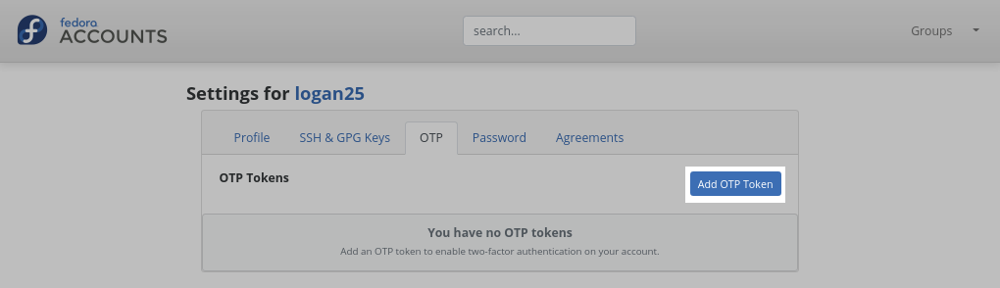

Next, add a name for the token and provide your password again. Something descriptive like the name of the app you are adding the token to
might prove useful it you decide to add more tokens later:

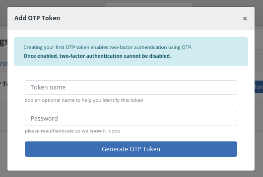

Your token is now created. Using your chosen authenticator application, scan the QR code and add it to your app.

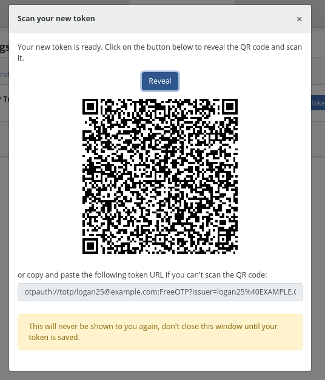

Next time you log in to Noggin, you will need to enter in your password followed by the 6 digit OTP code generated by your
chosen authenticator app.

What are recovery codes?
************************
Recovery codes are single-use backup codes that let you sign in if you lose access to your
authenticator device (phone loss, factory reset, hardware failure). Each code can only be used
once. After using a code, it is permanently consumed and cannot be reused.

Recovery codes work anywhere your OTP code works: Noggin login, SSH, FreeIPA WebUI, and any
other service that authenticates through FreeIPA.

How do I generate recovery codes?
**********************************
After adding your first OTP token, go to the **OTP** tab in your user settings. Scroll down
to the **Recovery Codes** section and enter your current password (and OTP code if you already
have a token). Click **Generate Recovery Codes**.

A set of 10 eight-digit recovery codes will be displayed. **Save these codes in a safe place** —
you will not be able to see them again. Store them in a password manager or print them and keep
them in a secure location.

You must check the "I have saved my recovery codes" checkbox before dismissing the codes dialog.

.. note::
    If your Noggin deployment has ``OTP_REQUIRE_RECOVERY_CODES`` enabled, recovery codes will
    be generated automatically when you enroll your first OTP token. You will be shown the codes
    immediately and must acknowledge saving them before continuing.

How do I use a recovery code?
*****************************
When prompted for your OTP code during login, enter one of your recovery codes instead of the
code from your authenticator app. Each recovery code is 8 digits (compared to the usual 6-digit
OTP code).

After a recovery code is used, it is consumed and cannot be used again. You can check how many
codes remain on the **OTP** tab of your user settings — the remaining count is shown with a
colored status badge:

- **Active** (green): You have a comfortable number of codes remaining.
- **Low** (orange): You are running low on codes. Consider regenerating.
- **Exhausted** (red): All codes have been used. Regenerate immediately.

How do I regenerate recovery codes?
************************************
If you have used some or all of your recovery codes, or if you believe they may have been
compromised, you can regenerate them. Go to the **OTP** tab in your user settings, scroll to
the **Recovery Codes** section, enter your password and OTP code, and click
**Regenerate Recovery Codes**.

This permanently invalidates all previous recovery codes and generates a fresh set of 10 codes.
Save the new codes in a safe place.

What happens if I lose my authenticator and have no recovery codes?
*******************************************************************
If you have lost your authenticator device and never generated recovery codes (or have used all
of them), you will need to contact your system administrator. If your Noggin deployment has
admin-assisted OTP recovery enabled, an authorized administrator can reset your OTP tokens and
provide you with temporary recovery codes to regain access to your account.

